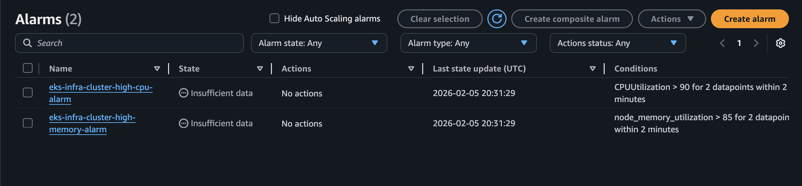
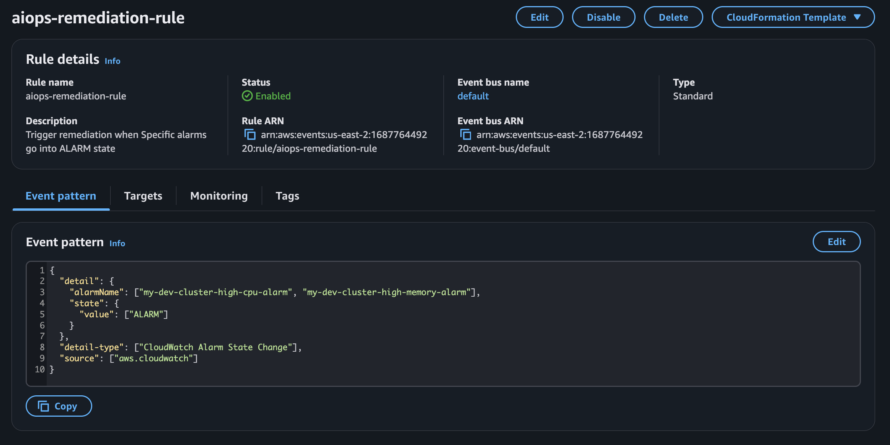
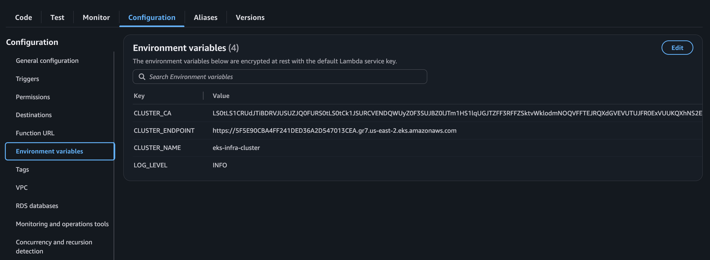
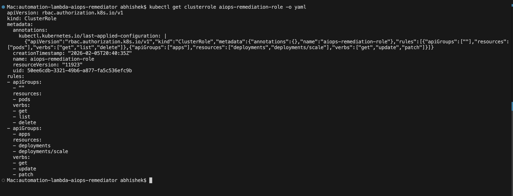
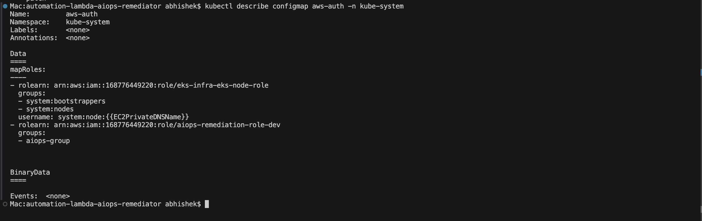
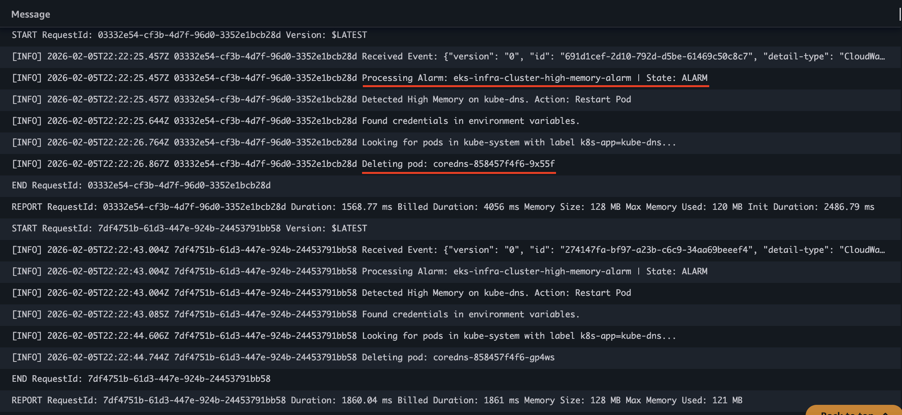
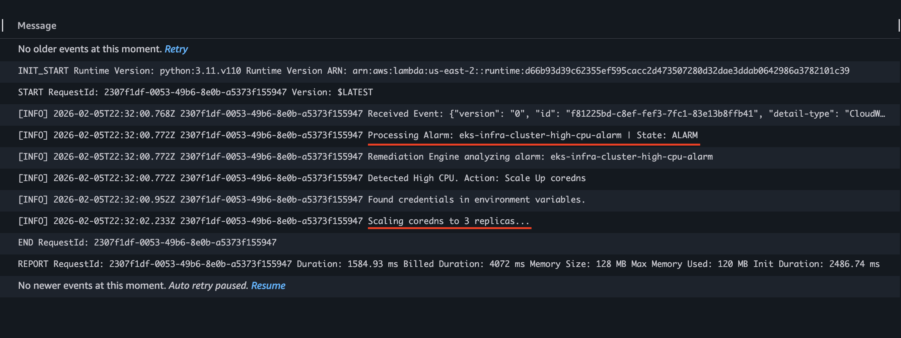

# Self-Healing EKS Infrastructure with AIOps


This project implements an automated **DevSecOps** pipeline that provisions a secure AWS EKS cluster and deploys an **AIOps Remediation Engine**. The system monitors infrastructure health in real-time and automatically "heals" issues (like High CPU or Memory Leaks) using Event-Driven Architecture.

## Features

* **Infrastructure as Code (IaC):** Fully automated provisioning of VPC, EKS, Node Groups, and IAM roles using Terraform.
* **AIOps Remediation Engine:** A Python-based AWS Lambda function that acts as a Kubernetes Operator to fix issues automatically.
* **Event-Driven Architecture:** Uses CloudWatch Alarms and EventBridge to trigger remediation actions based on real-time metrics.
* **Self-Healing Capabilities:**
    * **High CPU:** Automatically scales out deployments (Horizontal Pod Autoscaling).
    * **High Memory:** Proactively restarts unhealthy pods to clear memory leaks.
* **Security First:** Implements Least Privilege Access (RBAC), OIDC authentication, and secure networking.

## Architecture

1.  **Monitor:** CloudWatch tracks EKS metrics (CPU, Memory).
2.  **Detect:** Alarms trigger when thresholds are breached (e.g., CPU > 90%).
3.  **Route:** EventBridge captures the alarm state change and invokes the Lambda function.
4.  **Remediate:** The Python Lambda authenticates with the EKS API and executes targeted fixes.


## Usage

### 0. Build Dependencies
Before running Terraform, install the Python dependencies locally:
```bash
pip install -r src/lambda_function/requirements.txt -t src/lambda_function/
```

### 1. Provision Infrastructure
```bash
cd terraform/environments/dev
terraform init
terraform apply -auto-approve
```

### 2. Configure Kubernetes Access
Update your local kubeconfig to communicate with the new cluster:
```bash
aws eks update-kubeconfig --name eks-infra-cluster --region us-east-2
```

### 3. Grant Permissions (RBAC)
Map the Lambda IAM role to Kubernetes users to allow the engine to manage pods. This uses the permission file located in `k8s-config/rbac/`.
```bash
kubectl apply -f k8s-config/rbac/permissions.yaml
```

## Repository Structure

```bash
.
├── .github/
├── assets/
│   └── screenshots/        
├── k8s-config/
│   └── rbac/
│       └── permissions.yaml 
├── src/
│   └── lambda_function/    
│       ├── main.py
│       ├── remediation_logic.py
│       ├── k8s_ops.py
│       └── requirements.txt
├── terraform/
│   ├── environments/
│        └── dev/
│           └── backend.tf
│           └── main.tf
│           └── outputs.tf
│           └── providers.tf
│   └── modules/
│       └── anomaly-detection/
│           └── cloudwatch.tf
│           └── iam.tf
│           └── lambda.tf
│           └── outputs.tf
│           └── variables.tf
│       ├── event-bus/
│           └── main.tf
│           └── variables.tf
└── README.md
```

## Tech Stack

| Component | Technology | Usage |
| :--- | :--- | :--- |
| **Cloud Provider** | AWS | Hosting (EKS, Lambda, VPC, IAM) |
| **IaC** | Terraform | Infrastructure provisioning & State Management |
| **Orchestrator** | Kubernetes (EKS) | Container management |
| **Scripting** | Python 3.11 | Remediation logic (Boto3, K8s Client) |
| **Observability** | CloudWatch | Metrics & Alarms |
| **Event Bus** | EventBridge | Event routing & triggering |

## Inputs (Terraform)

| Name | Description | Type | Required |
|------|-------------|------|:--------:|
| `cluster_name` | Name of the EKS Cluster | `string` | yes |
| `region` | AWS Region (e.g., us-east-2) | `string` | yes |
| `vpc_cidr` | CIDR block for the VPC | `string` | yes |
| `environment` | Deployment environment (dev/prod) | `string` | yes |
| `node_group_desired_size` | Initial number of worker nodes | `number` | no |

## Outputs

| Name | Description |
|------|-------------|
| `cluster_endpoint` | The public API endpoint for the EKS cluster |
| `cluster_arn` | The Amazon Resource Name (ARN) of the cluster |
| `lambda_role_arn` | The ARN of the IAM role used by the Remediation Engine |

## Evidence of Execution

### 1. Monitoring

*Configured CloudWatch Alarms to monitor specific EKS metrics (CPU & Memory) and trigger remediation workflows.*

### 2. EventBridge

*Implemented EventBridge rules to asynchronously route alarm state changes to the serverless remediation engine.*

### 3. Lambda Configuration

*Utilized Terraform to dynamically inject cluster metadata and security credentials into the Lambda runtime environment.*

### 4. RBAC & Least Privilege

*Designed Kubernetes RBAC ClusterRoles to enforce Least Privilege, restricting the remediation engine to only specific remediation actions (pod deletion, deployment scaling).*

### 5. IAM Mapping

*Mapped AWS IAM Roles to Kubernetes RBAC groups using the aws-auth ConfigMap to enable secure, cross-service authentication.*

### 6. Trigger High Memory

*Logs of High Memory Alarm when triggered"*

### 7. Trigger High CPU

*Logs of High CPU Alarm when triggered*